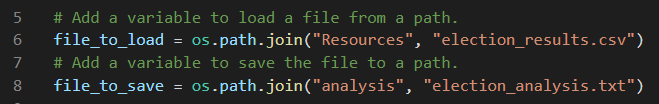
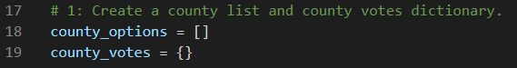
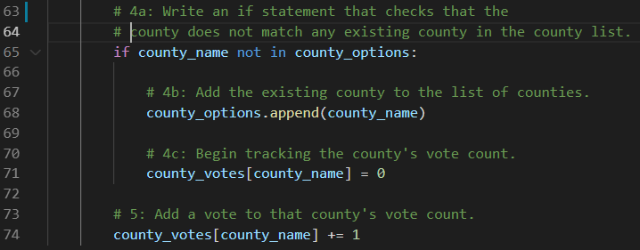
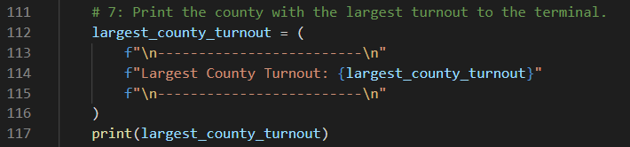
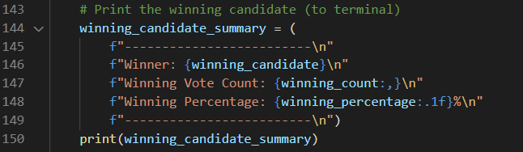
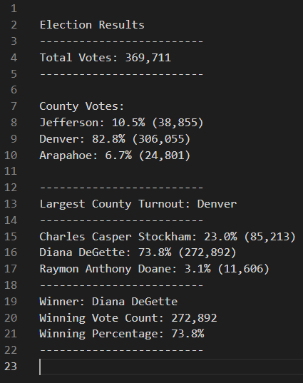

# Election Analysis

## Purpose
Seth and Tom request for the election audit results and the completion of additional data requested by the election commission. Other than finding out the winning candidate of the election, the commission asks for the voter turnout for each county, the percentage of votes from each county out of the total count, and report the county with the highest turnout.

## Analysis and Challenges
### Dependencies
There are two denpendencies for our program.The first is the **_csv_** import necessary for us to read the csv file provided by the commission. Second, we have to import the **_os_** to manipulate the paths in order to open and save our results in a text file. (below)

### Execution 
Within the program, we initialize our variables and set them to integer 0 and empty strings. We also created empty lists and dictionaries so we can systematically loop to check/print our election results and county turnout and votes. For example, for the county variables:

The loops embeded in the first _with_ operation are used to add candidate/county options to our lists and increase their respective vote counts as long as the county does not exist in the the list. (below)

Next we use with **with** command to open a text file we want to save our results. Below are codes we used to print the respective results:(below)

Finally, we inserted within for loops a _.write_ command to print the results on the text file named _election_analysis.txt_.

**example code shown saves the result to the file named election_results.txt**

### Results
When we execute the program, it printed the election results on the terminal saved them on election_analysis.txt. Results are as follows:

- **Total votes**
- **County votes and their vote percentages**
- **The Largest county turnout for the election**
- **Candidate votes and their percentages**
- **Winner of the election, their vote count, and the percentage vote received**

### Challenges and Difficulties Encountered
The overall challenge is fairly straight foward, similiar to the module exercices, counting county by votes instead of the candidates by their votes. There were some hiccups using the _os.path.join_ command when loading the file but eventually resolved.

## Summary
Election results(shown below) are saved on the text file name election_analysis.txt, printing the outcomes the same outline as was printed on the terminal. The total vote count is 369,711. The largest county turnout is Denver and the winning candidate is Diana DeGette, who received 272,892 votes which accounts for 73.8% of total votes.

### Pros and Cons
The major pro to this program is the use of csv file and the ability to read all the rows and assigning new candidates/counties that are not in our variable lists/dictionaries. This is significant as we can use data sets that contain more lines(votes in this case) and display the results without changing our codes. This program can be used as long as the file we are trying to read is a _csv file_ and is columned by "Ballot ID","County","Candidate."

The only con I forsee is unfortunately an issue with _csv_. The program can only read csv files and only if the columns are in the apporpriate order, since we assigned the variables to very specific columns in the file.

### For the election commission
As addressed above on under Pros and Cons, the program can be utlized for any numbers of candidates and their counties as long as the csv file contains commas seperating the values in the order of "Ballot ID","County","Candidate."
